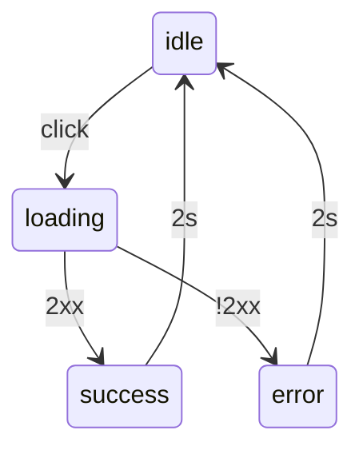

> 🔒 **Internal Only** — 본 문서는 내부용입니다. 외부 노출 자산(UI/알림/문서)에는 “AI” 단어 금지 정책을 따릅니다.

## Contents
- [팀/브랜딩 가이드라인](#팀브랜딩-가이드라인-개인화)
- [Dashboard — Merged Main](#dashboard--merged-main-no-right-sidebar)
- [Appendix A. 기능 상세 명세](#appendix-a-기능-상세-명세-api--데이터--상태)
- [Appendix B. 인터랙션 정의](#appendix-b-인터랙션-정의-배지버튼툴팁)
- [Appendix C. 백엔드 연동](#appendix-c-백엔드-연동-cloudflare-workers--d1)
- [Appendix D. 에러/상태 처리](#appendix-d-에러상태-처리-시나리오)
- [Appendix E. 버전/배포](#appendix-e-버전-관리--배포-프로세스)
- [Appendix F. 테스트/접근성](#appendix-f-테스트-케이스--접근성-점검)
- [Appendix G. 보안/권한](#appendix-g-데이터-보안--권한-검증)

# All New Sugar Rush 910 — 음악 협업 · 발매 · 수익 관리 시스템

- 기준일: 2025-08-19 (Asia/Seoul)
- 브랜드/아티스트: Sugar Rush
- 공개 URL: https://sugar-rush.team/
- 관리자 URL: https://admin.sugar-rush.team/ (공개와 완전 분리: 세션/권한/도메인 분리)
<br>
<br>
## 비전/원칙(개인화 우선)
- 원스톱 플로우: 아이디어 → 제작 협업 → 검수 → 발매 예약 → 자동 반영 → 사후분석/권리/수익
- 테마 컬러: 커버 이미지에서 자동 추출 → 후보 3색 제안 → 게이트 평가
- 게이트: ΔE00 ≥ 12, 대비(WCAG2.2 AA) ≥ 4.5:1, 최근 30개와 중복 금지, 브랜드 색(#FF2D96/#FF008C) 금지
- 특수 조건(전곡): 내부 스키마 tracks.ai_type = 'ai_composite' 고정(화면/문서 비노출)

## 외부 금칙(절대 준수)
- 외부 노출(웹·관리자 UI·문서·알림 등)에는 “AI” 단어 금지
- 내부 코드/DB 스키마에서만 ai_type 등 사용
- 위반 시 CI 금칙어 게이트로 빌드 실패

## 기술 스택
- 어떤 경우에도 오류·충돌 없이 가볍게 동작하도록 설계
- 언어 및 설정 통일: pnpm 워크스페이스 사용
- 주요 기술
  - SvelteKit (프론트엔드 프레임워크)
  - Tailwind CSS v4 (스타일링)
  - Pretendard 웹폰트 사용
  - Lucide-svelte 아이콘으로 고정
- 언어/설정 통일: 기본 설정을 확장하는 형태로 유지
- 반응형 디자인 적용: 모든 화면에서 미니멀하고 유연한 레이아웃 구현
  - 완전 반응형: grid를 유연하게 활용, 헤더 및 사이드 바 포함
- 아이콘: Lucide 아이콘 일괄 사용하며, 다운로드 방식으로 통일
- 개발 환경
  - Windows 운영체제
  - pnpm 패키지 매니저 환경에 맞춤 구성
- 백엔드 및 인프라
  - Cloudflare Workers 사용
  - Cloudflare D1 데이터베이스 활용
- Node.js 호환성 유지
- 폰트 및 레이아웃
  - Pretendard 폰트 사용
  - 미니멀하고 유연한 레이아웃 설계
- 아이콘 활용 규칙 및 색상 관리
  - Lucide 아이콘 사용 규칙 준수
  - ΔE00 색상 차이, 대비, 중복 게이트 적용
  - 2인 전환 가능 옵션 포함
  - 구글챗 알림 연동 기능 지원

### 환경 요구사항
- Node.js 20.x LTS
- pnpm 9.x
- Windows 10/11 (WSL2 가능)
<br>
<br>      
# 팀/브랜딩 가이드라인 (개인화)

## 1. 팀 / 권한 관리

- 팀 멤버: `El`, `Otte`
- 권한: 두 명 모두 Owner (Full 권한)
- RBAC(역할 기반 접근 제어) 및 필드 ACL 유지 (권리/계약 등 민감 필드는 마스킹)
- 모든 권한에 대해 1인 승인 처리 가능
- 승인 시 구글챗 알림 동기화

## 2. 기본 테마 (개인화 Extension)

### 로고 및 포인트 색상
- Main 컬러: `#FF2D96`
- Sub 컬러: `#FF008C`
- 주의: 로고/악센트 전용, 앨범 대표 색상으로는 **사용 금지**
  
### 앨범 썸네일 호버 효과
- **선택(호버)** 시 상단 **Sugar Rush 로고** 색상 동시 변환
- **해당 앨범 대표 색상**으로 로고 색도 **동기화**

### Sugar Rush 홈페이지
- 메인 배경색: `#000000`

### Sugar Rush Admin 디자인 규칙
- Lucide 아이콘만 사용  
  - 아이콘 모양만 사용 (텍스트 없음)  
  - 아이콘 크기: 16px  
  - 컨테이너 크기: 24×24px, 수직 가운데 정렬  
  - 다크 모드 기본 아이콘 색상: `#888888`
  - 라이트 모드 기본 아이콘 색상: `#D9CCBC`  
  - 상황별로 inline 스타일로 색상 변경 가능  
  - 예: `<History style="color: var(--user-el)" />`

### 공통 스타일
- Pretendard 웹폰트 설치 후 안정 적용
- 브랜드 & 상태 색상 변수
  ```
  --brand-pink: #FF3DAE;
  --hover-cyan: #17E1BC;
  ```
- 버튼 스타일 예시 (.btn-retry)
  ```
  .btn-retry {
    @apply inline-flex items-center justify-center h-[18px] px-2 rounded-full text-[11px] font-semibold leading-none;
    background: var(--brand-pink); 
    color: #FEFDF6;
    border: none;
  }
  .btn-retry:hover {
    background: var(--hover-cyan);
    color: #000;
  }
  ```

- 상태별 색상
  ```
  --danger-fg: #FF6B6B; /* 긴급/높음 */
  --warn-fg: #fffa00;   /* 주의/보통 */
  --ok-fg: #00ddff;     /* 정상/낮음 */
  ```

- 타입 배지 색상
  ```
  --tag-album: #FF3DAE;
  --tag-track: #68b1ff;
  --tag-deadline: #7ea59e;
  ```

### 다크 모드 색상 변수
```
--text-base: #888888;
--text-strong: #B6B6B6;
--text-muted: #6F6F6F;
--bg: #000000;
--surface-2: #121212; /* 카드 배경 */
--surface-1: #1A1A1A; /* 아이템 배경 */
--border-subtle: #252528;
```

### 라이트 테마 색상 변수 (아이보리 / 크림 / 베이지)

```
--text-base: #D9CCBC;
--text-strong: #C5b5A9;
--text-muted: #A59686;
--bg: #F7F3E9;      /* Ivory */
--surface-2: #F3EBDD; /* Cream */
--surface-1: #FFF8EF; /* Light-Cream */
--border-subtle: #D9CCBC; /* Beige 라인 */
```

### Admin 기본 모드
- El: 다크 모드 기본  
- Otte: 라이트 모드 기본  
- 로그인 시 각 사용자별 기본값으로 자동 적용됨  
- 다크/라이트 모드 전환은 루사이드의 **Eclipse 아이콘** 버튼 하나로 가능

### 멤버 컬러 토큰
| 사용자 | 라이트 모드 색상         | 다크 모드 색상        |
| ------ | ------------------------ | --------------------- |
| El     | Charcoal Black (#333434) | Cool Gray (#CFCFD4)   |
| Otte   | Sand Beige (#D7CBBF)     | Cream Beige (#FEFDF6) |

### 대시보드 작업자 표시색
```
--user-el: #A6FF00;
--user-ot: #FF835C;
```

### Breakpoints
- sm: 640px
- md: 768px
- lg: 1024px
- xl: 1280px

### Layout Sizing (통일 규칙)
- Header 높이: 56px → `h-[56px] px-6 sticky top-0 z-50`
- Header 3칸 그리드: `[240px, 1fr, auto]` → `grid grid-cols-[240px,1fr,auto]`
  - Left Slot: 로고(좌정렬) + 사이드바 토글(같은 X 좌표에 겹침 동작)
  - Center Slot: 페이지 타이틀/검색 결과 요약 등
  - Right Slot: 검색입력창(Search) · 알림(Bell) · 테마(Eclipse)
- Sidebar (drawer, md 이상 고정)
  - 폭: 240px → `w-[240px]`
  - 시작 Y: 56px → `top-14`
  - z-index: Drawer 40 / Backdrop 30 / Header 50
- Main
  - 좌우 패딩: 24px → `px-6`
  - **카드 그리드(통일):** `grid grid-cols-12 gap-4`
  - **열 규칙:**
    - 모바일 `<md`: `col-span-12`(1열)
    - 태블릿 `md~<lg`: `col-span-6`(2열)
    - 데스크탑 `≥lg`: `col-span-4`(3열)
  - **카드 높이:** 일반 `h-72` 통일 / **KPI만 예외** `h-80`
- Right Panel: **사용 안 함(삭제)**  ← 우측 사이드바 제거 정책

### 전체 레이아웃은 Tailwind CSS의 Flexbox 및 Grid 유틸리티 클래스를 활용하여 구성되며, 반응형 디자인에 최적화되어 있습니다.
- 주요 영역:
  - `Header`: 고정 위치
  - `Sidebar`: 토글 가능
  - `Main Content`: 사이드바 상태에 따라 유동적으로 확장
- 다양한 화면 크기에서도 안정적으로 작동하는 반응형 디자인 적용

### 상단바 메뉴(상단바는 고정된 헤더로서 사이드바의 상태 변화에 영향을 받지 않는 독립 레이어 구조, 영역내 같은 하단 여백, 메뉴 전체 하단 정렬)
#### Fixed Header Layout (고정 헤더 레이아웃)
- 상단바는 뷰포트 상단에 고정되어 있고,
- 좌측 사이드바가 열리거나 닫혀도 상단바의 요소들은 위치를 유지함.
#### Independent Layering (독립된 레이어 구조)
- UI 구성 요소들이 레이어처럼 분리되어 있음.
- 상단바는 최상단 레이어.
- 사이드바는 그 아래 레이어에서 열리고 닫힘.
- 이 구조 덕분에 사이드바가 변화해도 상단바는 재배치되지 않음.
#### Responsive Grid or Flex Layout (반응형 그리드 또는 플렉스 레이아웃)
- 전체 화면은 그리드 또는 플렉스 박스로 구성되어 있고,
- 상단바는  영역으로 고정.
- 사이드바는  영역으로 토글 가능.
- 콘텐츠 영역은 으로 유동적으로 확장됨.
- 이 방식은 반응형 디자인에 적합하고, 다양한 화면 크기에서도 안정적으로 작동함.
#### 상단바의 좌측 메뉴(좌측 사이드바와 같은 크기의 영역과 같은 X좌표 위치, 좌측 사이드바 좌/우 여백 동일)
##### 로고는 좌측 사이드바 아이콘과 같은 위치  좌측정렬
- Sugar Rush Logo=brand-pink: #FF3DAE;
##### 로고 옆 좌측 사이드바의 우측정렬(이 버튼으로 좌측 사이드바 열기/닫기, Copilot UI처럼 작동<로고와 버튼은 같은 자리 유지, 로고와 이 버튼이 밑의 레이어처럼 좌측 사이드바 열기/닫기>)
- panel-left-open 좌측 사이드바 열기
- panel-left-close 좌측 사이드바 닫기
#### 상단바의 가운데 영역
- 페이지 타이틀=brand-pink: #FF3DAE;
  - 상단바 가운데 영역 내 좌측 정렬
  - 로고 사이즈보다 작게
#### 상단바의 우측 메뉴(우측 사이드바와 같은 크기의 영역과 같은 X좌표 위치, 우측 사이드바 좌/우 여백 동일, 검색창과 알림과 다크/라이트 모드 버튼 사이의 여백이 서로 같다.)
#### 상단바 우측에 위치한 검색창 내부의 좌측 부분에는 루사이드아이콘 search가 위치.
- 검색과 동시에 검색값 출력
- 검색값이 없을 경우 유사항목 추천, 검색 버튼은 없음
- 포커스 시 검색창 hover-cyan: #17E1BC; 색상의 라인과 Search 아이콘으로 동시에 색상 변경
- 비포커스 시 검색창은 brand-pink: #FF3DAE; 색상의 검색창 라인과 Search 아이콘이 기본
#### 상단바 우측에 검색창과 다크/라이트 모드 버튼 사이에 위치한 알림버튼
- 루사이드의 Bell 아이콘
- 새로운 알림이 있을 때만 Bell 아이콘 우측 상단에 brand-pink: #FF3DAE; 색상의 작은점으로 새로운 알림 표시
#### 상단바 가장 우측에 위치한 다크/라이트 모드
- 다크/라이트 모드 전환은 루사이드의 **Eclipse 아이콘** 버튼 하나로 가능

### 좌측 사이드바 메뉴
#### (루사이드아이콘명 | 한글메뉴명)
- LayoutGrid 대시보드
- Disc3 앨범 관리
- Music 트랙 관리
- FolderOpen 업로드·검증 센터
- Heart 제작·협업 보드
- Rocket 발매 관리
- DollarSign 수익 관리
- Calendar 일정·캘린더
- MessageSquare 피드백·알림 센터
- Shield 보안·운영 관리
- Settings 설정

### 메인 영역(반응형으로 패널 균일<유동적 확장배치>)
- **카드 세트(최종):**
  - 할 일
  - 멘션
  - 카운트다운(마감 임박)
  - 실패 태스크(재시도)
  - 시스템 상태
  - 최근 변경
  - 피드백
  - 오늘 발매 일정
  - 빠른 액션
  - 시스템 로그
  - **KPI 요약 그래프**(유일한 예외: 풀폭/높이↑)

# Dashboard — Merged Main (No Right Sidebar)
본 대시보드는 우측 사이드바 패널을 제거하고 **메인 그리드에 통합**한 레이아웃입니다.  
업무 흐름 기준으로 **내 작업 → 위험/복구 → 협업/변경 → 운영 로그 → KPI** 순서를 따릅니다.  

## Principles
- **균일 카드**: KPI만 예외(`h-80`), 나머지는 동일 높이(`h-72`), 내부 스크롤 금지
- **반응형**: 모바일 1열 → 태블릿 2열 → 데스크탑 3열(12-column grid)
- **정보 과잉 방지**: 카드당 최대 4행 노출, 초과는 “더보기” 링크로 이동
- **아이콘**: Lucide(다운로드 SVG) 일관 사용

## Grid Rules
- Container: `grid grid-cols-12 gap-4`
- Desktop(≥lg): 카드 `col-span-4`(3열), KPI는 `col-span-12`
- Tablet(md~<lg): 카드 `col-span-6`(2열)
- Mobile(<md): `col-span-12`(1열)

## Desktop (≥lg) — 12-column ASCII Mockup
```text
- [Header ─────────────────────────────────────────────────────]
...

- [Sidebar: 11 menus]

- [Main: grid-cols-12]
  - Row 1
    - ├ col 1-4 [할 일 · 멘션] ┐ 즉시 처리(내 작업)
    - ├ col 5-8 [카운트다운(일정)] │ 마감/예약 발매 D-n
    - └ col 9-12 [실패 태스크(재시도)] ┘ 복구 액션

  - Row 2
    - ├ col 1-4 [시스템 상태] ┐ 운영 스냅샷
    - ├ col 5-8 [최근 변경] │ 편집·배포·정책 로그
    - └ col 9-12 [피드백] ┘ 코멘트/리뷰

  - Row 3
    - ├ col 1-4 [오늘 발매 일정] ┐ 당일 중심 일정
    - ├ col 5-8 [빠른 액션] │ 새 앨범/트랙/업로드/정산
    - └ col 9-12 [시스템 로그] ┘ 운영 이벤트

  - Row 4
    - └ col 1-12 [KPI 그래프(전체 너비)] ← 유일한 예외(높이 ↑)
```

## Tablet (md ~ <lg) — 2-column ASCII Mockup
- Row 1 [할 일 · 멘션] | [카운트다운]
- Row 2 [실패 태스크] | [시스템 상태]
- Row 3 [최근 변경] | [피드백]
- Row 4 [오늘 발매 일정]| [빠른 액션]
- Row 5 [시스템 로그] | —
- Row 6 [KPI 그래프(풀폭)]

## Mobile (<md) — 1-column Stack
- [할 일 · 멘션]
- [카운트다운]
- [실패 태스크(재시도)]
- [시스템 상태]
- [최근 변경]
- [피드백]
- [오늘 발매 일정]
- [빠른 액션]
- [시스템 로그]
- [KPI 그래프(풀폭)]

## Card Set & Links
- **할 일 · 멘션**: `/tasks`, `/mentions`
- **카운트다운**: `/calendar`
- **실패 태스크(재시도)**: **Retry/Runbook** → `/runbook`  
  - Retry 상태: `idle → loading → success|error(2s) → idle`  
  - 디바운스 15s, `aria-live="polite"`
- **시스템 상태**: `/status`
- **최근 변경**: `/changes`
- **피드백**: `/feedback`
- **오늘 발매 일정**: `/releases`
- **빠른 액션**: `/albums/new`, `/tracks/new`, `/files/upload`, `/revenue`
- **시스템 로그**: `/logs`
- **KPI 그래프**: `/kpi`

## 추가 보완 규칙 (실시간성 · 전환성 · 온보딩 강화)

본 섹션은 대시보드 카드의 사용성을 높이기 위한 **가벼운 UI 증분 규칙**입니다.  
기존 원칙(내부 스크롤 금지, 카드 높이 균일, KPI만 예외, 반응형 1/2/3열)은 그대로 유지됩니다.

### 1) 모바일 실시간성 강조 — 배지(우선/최근)
- 목적: 작은 화면에서 **바로 주목**해야 할 항목을 한눈에 구분
- 표기: 카드의 개별 리스트 항목 우측 끝에 **배지** 표시
- 노출 규칙:
  - **모바일 전용** → `md:hidden`
  - 항목당 **최대 1개 배지**
- 배지 토큰:
  - `우선`(priority) → 긴급/우선 처리
  - `최근`(recent) → 방금 바뀐 항목
- 색상 가이드(예시): 프로젝트 팔레트 내에서 선택  
  `--danger-fg`(우선), `--ok-fg`(최근) 등

> 예) “할 일”의 우선 항목, “최근 변경”의 갓 변경 항목에 배지

### 2) 카드 상단 미니 통계(3칸)
- 목적: 각 카드의 **현재 상태 스냅샷**을 한 줄로 요약
- 레이아웃: 타이틀 하단 **3칸 그리드**(예: `grid grid-cols-3 gap-2`)
- 권장: `h-8`, `text-[11px]`
- 예시:
  - 할 일: `열림 | 오늘 | 지연`
  - 실패 태스크: `실패 | 재시도 | 차단`
  - 최근 변경: `오늘 | 이번주 | 이번달`

### 3) 전환 버튼(작은 2버튼)
- 목적: 카드에서 **바로 다음 업무로 전환**
- 위치: 카드 **하단**, 우측 정렬 권장
- 개수: **최대 2개**(주경로 1, 보조경로 1)
- 예:
  - 할 일: `새 태스크` / `멘션`
  - 카운트다운: `발매 관리` / `일정 추가`
  - 실패 태스크: `재시도` / `원인`

### 4) Tooltip(Info 아이콘) — 역할 설명
- 목적: 카드의 **의도/사용법**을 즉시 안내
- 위치: 타이틀 우측 **Info 아이콘**
- 동작: **hover + focus** 시 노출, `role="tooltip"`
- 접근성: 키보드 포커스 가능(hover-only 금지), **간결한 한 문장**

### 5) 접근성(공통)
- 모든 버튼/아이콘에 `aria-label`
- 상태 변화(재시도 버튼)는 `aria-live="polite"`
- 포커스 링 ≥ 1.5px, 텍스트 대비 WCAG 2.2 AA(≥ 4.5:1)

### 6) 카드별 권장 보완 예시
- **할 일**
  - 미니 통계: `열림 | 오늘 | 지연`
  - 모바일 배지: 우선 항목에 `우선`
  - 전환 버튼: `새 태스크` / `멘션`
  - Tooltip: “내가 해야 할 업무와 호출 멘션 요약”
- **카운트다운**
  - 미니 통계: `이번주 일정 | 마감 D-n | 예약 발매 n건`
  - 전환 버튼: `발매 관리` / `일정 추가`
  - Tooltip: “예약 발매·마감 임박 일정 요약”
- **실패 태스크**
  - 미니 통계: `실패 | 재시도 | 차단`
  - 전환 버튼: `재시도` / `원인`
  - Tooltip: “실패 작업 복구 또는 원인 분석 전환”
- **최근 변경**
  - 미니 통계: `오늘 | 이번주 | 이번달`
  - 모바일 배지: 최근 변경건에 `최근`
  - 전환 버튼: `히스토리`
  - Tooltip: “편집·배포·정책 변경 요약”

### 7) 테마 토글(최종 결정 반영)
- 아이콘: **Eclipse**로 통일(Lucide)
- 동작: **클릭할 때마다 다크/라이트 전환**
- 유지: `localStorage('sr_theme')` 저장으로 재방문 유지
- 초기 적용: 첫 페인트 전 토글 스니펫으로 FOUC 방지

## Appendix A. 기능 상세 명세 (API · 데이터 · 상태)

```ts
type ApiOk<T> = { ok: true; data: T };
type ApiErr = { ok: false; error: { code: string; message: string; details?: any } };
```

### A-1) 대시보드 카드별 API 계약

| 카드        | 메소드/경로                | 쿼리              | 응답 데이터 타입(요약)                           |
| ----------- | -------------------------- | ----------------- | ------------------------------------------------ |
| 할 일       | GET `/api/tasks`           | `limit=4`         | `{ id, title, priority:boolean, due?:string }[]` |
| 멘션        | GET `/api/mentions`        | `limit=4`         | `{ id, text, from, ts }[]`                       |
| 카운트다운  | GET `/api/deadlines`       | `limit=4`         | `{ id, label, d:string }[]`                      |
| 실패 태스크 | GET `/api/failures`        | `limit=4`         | `{ id, text, retryable:boolean }[]`              |
| 재시도   | POST `/api/failures/retry` | body `{ id }` | `{ id, status:'queued' \| 'ok' \| 'failed' }` |
| 시스템 상태 | GET `/api/status`          | -                 | `{ key:string, value:string }[]`                 |
| 최근 변경   | GET `/api/changes`         | `limit=4`         | `{ id, text, recent:boolean }[]`                 |
| 오늘 발매   | GET `/api/releases/today`  | `limit=4`         | `{ id, title, when }[]`                          |
| 빠른 액션   | GET `/api/actions`         | -                 | `{ label, href }[]`                              |
| 시스템 로그 | GET `/api/logs`            | `limit=4`         | `{ id, text, ts }[]`                             |
| KPI 그래프  | GET `/api/kpi`             | `range=7d \| 30d` | `{ series:{name,points:[{x,y}]}[] }`             |

> 모든 GET은 200/4xx/5xx. 에러는 `ApiErr`로 통일.

### A-2) 프런트 상태 관리

- 페이지 로드(+page.ts)에서 `Promise.all()` 병렬 페치 → Svelte `data`로 주입  
- 각 카드는 **단방향 데이터** props만 받기  
- 재시도 버튼 **상태 머신**



---

## Appendix B. 인터랙션 정의 (배지/버튼/툴팁)

| 요소        | 사용자 행동 | 시스템 동작                                      | 예외/에러                               |
| ----------- | ----------- | ------------------------------------------------ | --------------------------------------- |
| 재시도 버튼 | 클릭        | POST `/api/failures/retry` 호출, 버튼 15s 쿨다운 | 네트워크 에러 → `error` 상태 2s 후 idle |
| “모두 보기” | 클릭        | 상세 경로로 이동                                 | -                                       |
| 빠른 액션   | 클릭        | 링크 이동 또는 모달                              | -                                       |
| 툴팁        | hover/focus | 텍스트 노출 (`role="tooltip"`)                   | 모바일은 포커스 기반만                  |

* 배지: `md:hidden`(모바일 전용), 항목당 최대 1개
* 전환 버튼: 카드 하단, 최대 2개(주·보조)

---

## Appendix C. 백엔드 연동 (Cloudflare Workers · D1)

### C-1) D1 스키마(요약)

```sql
CREATE TABLE tasks (id TEXT PRIMARY KEY, title TEXT NOT NULL, priority INTEGER NOT NULL DEFAULT 0, due TEXT);
CREATE TABLE failures (id TEXT PRIMARY KEY, text TEXT NOT NULL, retryable INTEGER NOT NULL DEFAULT 1, status TEXT NOT NULL DEFAULT 'failed');
CREATE TABLE changes (id TEXT PRIMARY KEY, text TEXT NOT NULL, recent INTEGER NOT NULL DEFAULT 1, ts INTEGER);
CREATE TABLE metrics (key TEXT PRIMARY KEY, value TEXT NOT NULL);
CREATE TABLE releases (id TEXT PRIMARY KEY, title TEXT NOT NULL, when TEXT);
CREATE TABLE logs (id TEXT PRIMARY KEY, text TEXT NOT NULL, ts INTEGER);
CREATE TABLE users (id TEXT PRIMARY KEY, email TEXT UNIQUE, role TEXT NOT NULL); -- owner|editor|viewer
CREATE TABLE audit_log (id TEXT PRIMARY KEY, actor TEXT, action TEXT, target TEXT, ts INTEGER);
```

### C-2) SvelteKit API 라우트 예시

```ts
// src/routes/api/tasks/+server.ts
import type { RequestHandler } from './$types';
export const GET: RequestHandler = async ({ platform, url }) => {
  const limit = Number(url.searchParams.get('limit') ?? 4);
  const db = platform?.env?.DB as D1Database;
  const { results } = await db
    .prepare('SELECT id,title,priority,due FROM tasks LIMIT ?')
    .bind(limit)
    .all();
  return new Response(JSON.stringify({ ok: true, data: results }), {
    headers: { 'content-type': 'application/json' }
  });
};
```

```ts
// src/routes/api/failures/retry/+server.ts
import type { RequestHandler } from './$types';
export const POST: RequestHandler = async ({ request, platform }) => {
  const body = await request.json().catch(() => ({}));
  if (!body.id) {
    return new Response(
      JSON.stringify({ ok: false, error: { code: 'BAD_INPUT', message: 'id required' } }),
      { status: 400 }
    );
  }
  const db = platform?.env?.DB as D1Database;
  await db.prepare('UPDATE failures SET status=? WHERE id=?').bind('queued', body.id).run();
  return new Response(JSON.stringify({ ok: true, data: { id: body.id, status: 'queued' } }), {
    headers: { 'content-type': 'application/json' }
  });
};
```

### C-3) wrangler.toml (요약)

```toml
name = "sugar-rush-admin"
compatibility_date = "2024-11-20"

[[d1_databases]]
binding = "DB"
database_name = "sugar_rush"
database_id = "REPLACE_WITH_YOUR_D1_ID"
```

---

## Appendix D. 에러/상태 처리 시나리오

* HTTP: 2xx=성공, 4xx=검증/권한, 5xx=서버
* 프런트 표시:

  * 로딩: 버튼 스피너/disable, 카드 스켈레톤 1\~2줄
  * 실패: 상단 토스트 또는 카드 내 경고 2초
  * 재시도: 상태 머신 + 15s 쿨다운

**표준 에러 예시**

```json
{ "ok": false, "error": { "code":"NOT_AUTHORIZED", "message":"권한이 없습니다." } }
```

---

## Appendix E. 버전 관리 · 배포 프로세스

* 브랜치: `main`(prod), `develop`(stg), `feat/*`
* CI 스텝(권장): typecheck/lint/test → D1 migrations dry-run → `wrangler deploy --env=staging` → 태그 시 prod

**루트 스크립트 예시**

```json
{
  "scripts": {
    "dev": "pnpm --filter @sugar/admin dev",
    "build": "pnpm --filter @sugar/admin build",
    "deploy:stg": "wrangler deploy --env=staging",
    "deploy:prod": "wrangler deploy --env=production"
  }
}
```

---

## Appendix F. 테스트 케이스 · 접근성 점검

* 단위테스트(백엔드)

  * `/api/tasks` limit 검증(음수/문자) → 400
  * `/api/failures/retry` id 누락 → 400, 미존재 id → 404
* UI 테스트

  * 재시도 버튼 전이 idle → loading → success/error → idle
  * 모바일 배지 `md:hidden` 동작
  * 툴팁 키보드 포커스 노출
* 접근성

  * 대비 AA(≥4.5:1), 포커스 링 ≥ 1.5px
  * `aria-label`, `aria-live="polite"`
  * `header/aside/main` 시맨틱 준수

---

## Appendix G. 데이터 보안 · 권한 검증

* 인증 우선순위: **Cloudflare Access** → 세션 쿠키
* RBAC: `users.role ∈ {owner, editor, viewer}` (재시도는 editor+)
* SvelteKit hook 예시

```ts
// src/hooks.server.ts
import type { Handle } from '@sveltejs/kit';
export const handle: Handle = async ({ event, resolve }) => {
  // TODO: Access 또는 세션 검증 → event.locals.user = { id, role }
  return resolve(event);
};
```

* 입력 검증: 모든 파라미터 서버 검증 + SQL 바인딩
* 감사 로그: 변경/재시도는 `audit_log` 기록

## 개발 지시문 (for Cursor)
- 본 README와 Appendix A~G를 계약으로 삼아 Admin 대시보드 초기 버전을 구현한다.
- 목표 범위(스텝 1):
  1) pnpm 워크스페이스 초기화(@sugar/admin) 및 SvelteKit 템플릿 구성, Tailwind v4, Pretendard 세팅.
  2) `src/app.html`에 테마 FOUC 방지 스니펫 삽입, Eclipse 아이콘 토글 컴포넌트 구현(localStorage 연동).
  3) 고정 Header/Sidebar/Main 12-col 그리드와 카드 스켈레톤(11종 + KPI) 배치. 내부 스크롤 금지, 반응형 규칙 준수.
  4) Appendix C의 D1 스키마 기준으로 API 라우트 스텁 구현(`/api/*`) 및 `ApiOk/ApiErr` 타입 적용.
  5) Appendix D 로딩/에러 상태·스켈레톤·토스트, 재시도 버튼 상태 머신/쿨다운 반영.
  6) Appendix E CI 파이프라인과 “금칙어 게이트” 추가(GitHub Actions). 공개 자산에서 “AI” 탐지 시 실패.
  7) Appendix F 테스트(간단한 라우트 단위테스트 + 접근성 smoke) 작성.
  8) Appendix G 인증 훅(틀)과 RBAC 가드(에딧/재시도 editor+) 스텁.

- 완료 기준(acceptance):
  - 화면: 데스크탑/태블릿/모바일 브레이크포인트에서 카드 레이아웃이 규격대로 동작.
  - 기능: `/api/*`가 D1 없이도 목 데이터로 200 응답하며, 실패 시 ApiErr 포맷을 반환.
  - 접근성: 헤더/사이드바/메인 landmark, 포커스 이동/표시 정상.
  - CI: 린트/테스트 통과, 공개 자산 “AI” 금칙어 체크 동작.


